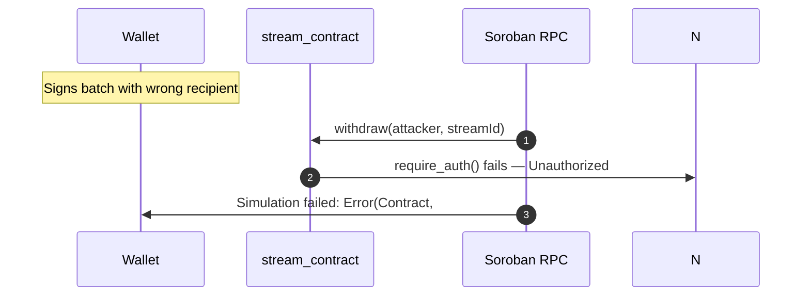
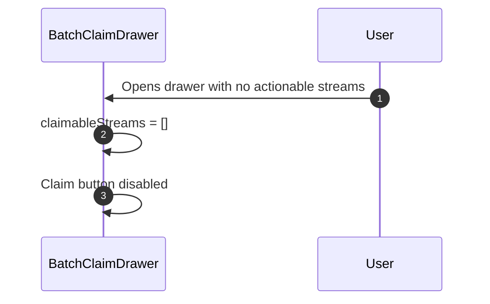

# Batch Withdrawal — Architecture & Sequence Flow

> **Scope:** end-to-end data and transaction flow for batch withdrawal, from the recipient's browser to the on-chain `TokensWithdrawn` event and the SSE frame that updates every connected client. Complements [ARCHITECTURE.md](../ARCHITECTURE.md), which covers the single-action lifecycle.

## Actors

| Actor | Lives in | Responsibility |
|---|---|---|
| Recipient wallet | Browser (Freighter) | Selects streams, signs the assembled transaction |
| `BatchClaimDrawer` | `frontend/src/components/dashboard/BatchClaimDrawer.tsx` | Computes claimable per stream, builds `BatchWithdrawParams`, submits |
| `batchWithdrawFromStreams` | `frontend/src/lib/soroban.ts` | Builds **one transaction containing N `withdraw` ops**, simulates, requests signature, submits |
| Soroban RPC | Stellar testnet / mainnet | `simulateTransaction`, `sendTransaction`, `getTransaction`, `getEvents` |
| `stream_contract` | `contracts/stream_contract/src/lib.rs` | Enforces `recipient.require_auth()` per stream; emits one `tokens_withdrawn` event per successful withdrawal |
| `SorobanEventWorker` | `backend/src/workers/soroban-event-worker.ts` | Polls `getEvents`, decodes XDR, upserts `Stream` / `StreamEvent`, broadcasts SSE |
| `SSEService` | `backend/src/services/sse.service.ts` | Fan-out to `sse:stream:<id>` and `sse:user:<address>` channels |
| SSE client | `frontend/src/hooks/useStreamEvents.ts` | Applies the delta to the dashboard without a refetch |

## Why "N ops in one tx", not a contract-level `batch_withdraw`

The contract exposes only `withdraw(recipient, stream_id)`. The SDK-side `batch_withdraw` **helper** in `frontend/src/lib/soroban.ts` and the backend's `simulateStreamAction('batch_withdraw', …)` path both do the same thing: **chain N `contract.call('withdraw', …)` operations onto a single `TransactionBuilder`**. This has two consequences the diagram must show:

1. **Atomicity.** Soroban's transaction model is all-or-nothing. If any one `withdraw` op reverts (stream already closed, wrong recipient, paused), **the whole batch reverts** — no partial claim. The UI must therefore treat a batch failure as "nothing changed", not "some streams claimed".
2. **One signature, one fee.** The recipient signs once; the network charges one resource fee for the entire batch.

## Happy Path

```mermaid
sequenceDiagram
    autonumber
    participant W as Wallet (Freighter)
    participant D as BatchClaimDrawer
    participant S as soroban.ts
    participant R PrC as Soroban RPC
    participant C as stream_contract
    participant IW as SorobanEventWorker
    participant DB as PostgreSQL via Prisma
    participant SSE as SSEService
    participant FE as Dashboard

    Note over D: User selects N streams and clicks "Claim selected"
    D->>S: batchWithdrawFromStreams(session, { streamIds: [id1..idN] })
    S->>RPC: getAccount(session.publicKey)
    RPC>>-S: Account
    S->>H: TransactionBuilder.addOperation(contract.call("withdraw", [addr, id1])) x N
    S->>HPC: simulateTransaction(unsignedTx)
    RPC>>-S: SimulateTransactionSuccessResponse
    S->>H: assembleTransaction(tx, sim).build()
    S->>H: signTransaction(preparedTxXdr, networkPassphrase)
    W->>S: signedTxXdr
    S->>HPC: sendTransaction(signedTx)
    RPC>>-S: txHash
    S->>D: success
    D->>DE: toast.success
    N->>I:
    IW->>RPC: getEvents()
    RPC>>-IW: Events[]
    IW->>DB: upsert StreamEvent
    IW->>SSE: broadcastToStream()
    SSE->>FE: SSE frame
    FE->>FE: apply delta
```

## Error Scenarios

### A. Partial claim is impossible — one failure reverts the batch

```mermaid
sequenceDiagram
    autonumber
    participant W as Wallet (Freighter)
    participant S as soroban.ts
    participant R as Soroban RPC

    Note over S: Necessary again (same call)
    S->>HPC: simulateTransaction(tx with 3 ops)
    Note over R: Op #2 reverts: StreamError::StreamPaused
    R->>S: SimulationError
    S->>W: throw SorobanCallError
    N->W: Nothing was signed; no mutation
```

### B. Unauthorized — recipient ≠ stream recipient



### C. Zero claimable — nothing to withdraw



## Stream state after the event

For every successfully decoded `tokens_withdrawn` event, the worker performs one transaction:
1. **Idempotency guard** — `findUnique({ transactionHash, eventType: "WITHDRAWN" })`. If a row exists, return without mutating `Stream.withdrawnAmount`.
2. **Update** — `Stream.withdrawnAmount += amount`, `lastUpdateTime = event.timestamp`.
3. **Persist)** — upsert `StreamEvent` keyed on `(transactionHash, eventType)`.
4. **Broadcast** — `sseService.broadcastToStream(streamId, "stream.withdrawn", payload)`.

When `withdrawnAmount >= depositedAmount`, the stream deactivates and the contract emits `stream_completed`.

## Multi-instance note

With Redis enabled, `broadcastToStream` publishes to `sse:stream:<id>` and every API replica re-emits to its local clients. Without Redis, the broadcast is in-process only.
